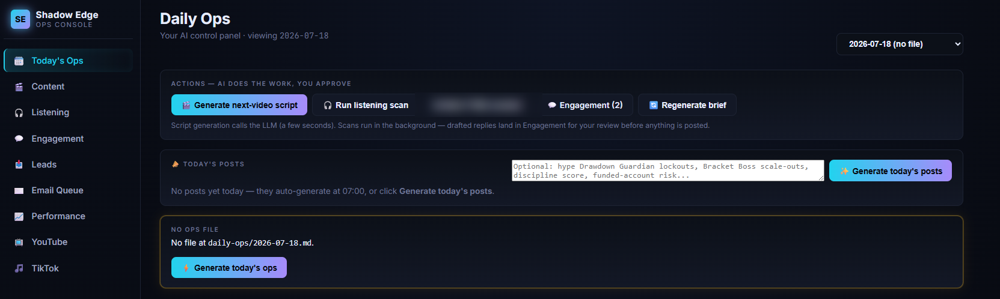
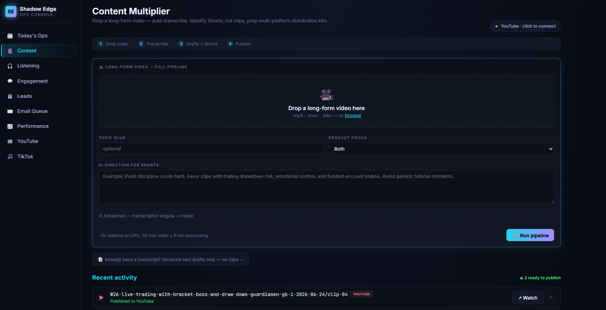
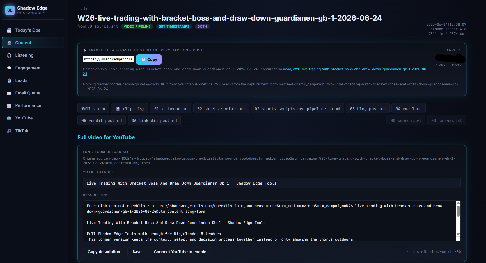
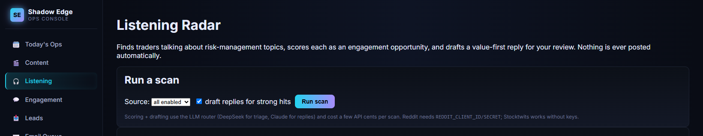
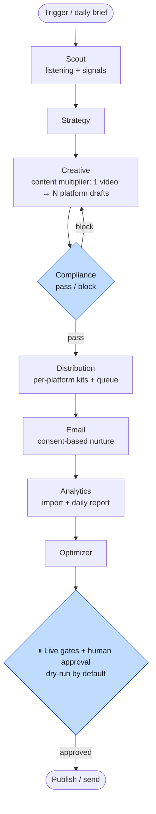

# Shadow Edge Marketing Ops Console

**An AI-run marketing operations platform for a one-person software business — an 8-agent automated team (Scout → Strategy → Creative → Compliance → Distribution → Email → Analytics → Optimizer) that turns one long video into a multi-platform campaign, captures and nurtures leads, imports analytics, and produces a daily ops plan — all behind hard safety gates.**

"Hermes" runs the daily marketing loop: campaign generation, a content
multiplier (long video → transcript → shorts → six-platform drafts + distribution
kits), compliance checks, manual/kit distribution queueing, consent-based lead
capture, email-nurture queueing, analytics import/reporting, and daily ops
reports — orchestrated across Anthropic/OpenAI/Google models via a per-role LLM
router, with an append-only audit trail for every agent run and publish action.

> **In production for a real business:** this pipeline produces the videos on the
> [@ShadowEdgeTools](https://www.youtube.com/@ShadowEdgeTools) YouTube channel and
> the accompanying cross-platform social posts.

**Safety-first by design:** dry-run/manual is the default. Nothing is emailed or
published to any platform unless *every* live gate passes — CLI `--live`, config
flag, platform `api_enabled`, present credential, `compliance: pass`, and explicit
per-item approval. Metrics are never estimated; unmeasurable ones are marked
`blocked` or `not_configured`.

> **Note on data:** live business data (campaigns under `content/`, production
> state under `state/`, and daily briefings) is local-only and not part of this
> repository — the pipeline code and configuration are what's tracked here. The
> app generates its own `content/` and `state/` on first run.

## What it looks like



<table>
<tr>
<td width="50%"></td>
<td width="50%"></td>
</tr>
</table>

<p align="center"><em>One long video in (left) · a full multi-platform distribution kit out (right)</em></p>



## Pipeline



## Quick start

```cmd
start-console.bat
```

Open:

`http://localhost:8876/autopilot`

Run Hermes without the console:

```cmd
run-hermes.bat --dry-run
run-hermes-team.bat --dry-run
```

Or directly:

```cmd
set PYTHONNOUSERSITE=1
python scripts\autopilot.py --dry-run
python scripts\hermes.py --dry-run
python scripts\hermes_team.py --dry-run
python scripts\launch_readiness.py
python scripts\activation.py status
python scripts\activation.py drill
python scripts\canary.py status
python scripts\canary.py candidates
python scripts\canary.py preflight --channel x
python scripts\canary.py dry-run --channel x
python scripts\canary.py go-no-go
python scripts\production_check.py
python scripts\queue_hygiene.py report
python scripts\lead_capture_smoke.py
python scripts\launch_drill.py
```

## What Hermes does now

Hermes now has two safe local loops:

- `scripts/hermes.py --dry-run`: single-run campaign pack + compliance + queue workflow.
- `scripts/hermes_team.py --dry-run`: first-class automated marketing team that runs Scout, Strategy, Creative, Compliance, Distribution, Email, Analytics, and Optimizer agents in sequence.

A dry-run creates or updates:

- `content/YYYY-MM-DD-campaign-slug/` campaign pack
- channel assets for X, Stocktwits, TikTok, LinkedIn, YouTube, and Email
- `08-compliance-check.md`
- per-platform manual kits under `content/.../distribution/<platform>/`
- `daily-ops/hermes-YYYY-MM-DD.md`
- append-only run history in `state/hermes-runs.jsonl`
- idempotent manual publish queue in `state/publish-queue.jsonl`

The lead form writes to `state/leads.jsonl`. Consented leads queue nurture emails in `state/email-queue.jsonl`; duplicate lead submissions do not duplicate the same campaign/step sequence.

## Console pages

- `/hermes` — Hermes run history and dry-run/live-gated trigger.
- `/campaigns` — generated campaign folders.
- `/leads` — captured leads and CSV export.
- `/lead/{campaign_id}` — local lead capture form with consent checkbox and UTM fields.
- `/api/leads` — JSON public-site lead handoff for a deployed form/backend bridge.
- `/email-queue` — queued nurture emails; locally mark skipped/sent or suppress a lead.
- `/publish-queue` — copy-ready manual assets; approve, skip, or record manual published URL.
- `/performance` — analytics report plus CSV import form.
- `/team` — automated team report, recent agent runs, and task links.
- `/autopilot` — final one-screen local operating command center.
- `/health` — health blockers, open-task summary, queue aging, and integration readiness.
- `/launch` — daily launch readiness checklist and external blocker summary.
- `/activation` — go-live gate, credential/config preflight, review batches, and canary activation readiness.
- `/canary` — controlled canary command center: candidates, first-live-action preflight, approval ledger, rollback, and go/no-go packet.
- `/approvals` — combined approval inbox for publish, email, brand voice, and integration setup.
- `/agent-runs` — append-only agent execution history.
- `/agent-tasks` — persistent autonomous task board.
- Existing pages for dashboard, today, pipeline, content, affiliates, state, and YouTube settings remain available.

## Manual publishing workflow

1. Run `run-hermes.bat --dry-run`.
2. Open `/publish-queue`.
3. Review copy-ready body, CTA, UTM URL, compliance status, and manual kit files.
4. Click Approve when ready.
5. Publish manually on the platform.
6. Paste the live URL and click Mark published.

All manual changes append events to `state/publish-log.jsonl`. API publishing stays disabled unless official API support is verified and explicit gates are enabled.

## Email workflow

1. Use `/lead/{campaign_id}` or an equivalent form to capture consent.
2. Consented leads are queued into the configured nurture sequence.
3. Open `/email-queue` to review queued messages.
4. Mark skipped, mark manually sent, or suppress the lead.

All email queue/suppression events append to `state/email-events.jsonl`. Sending is disabled by default.

## Analytics CSV import

Import from `/performance` or CLI:

```cmd
python scripts\analytics.py import-csv state\manual-metrics\example.csv
python scripts\analytics.py report --date 2026-05-30
```

Schema:

```csv
date,campaign_id,metric,value,source,status
2026-05-30,20260530-risk-control-multiplier,landing_page_clicks,12,manual_csv,measured
2026-05-30,20260530-risk-control-multiplier,revenue,,manual_csv,blocked
2026-05-30,20260530-risk-control-multiplier,website_sessions_by_source,,manual_csv,not_configured
```

Supported status values:

- `measured` — real metric value exists.
- `blocked` — metric cannot be reported because a credential/approval/source is blocked.
- `not_configured` — metric provider/import is not wired yet.

Hermes never estimates metrics.

## Live gates

Live publishing requires all of these:

- CLI requested `--live`
- `config/hermes.yaml` has `live_publish_enabled: true`
- platform has `api_enabled: true`
- required credential env var is present
- compliance status is `pass`
- queue item approval status is `approved`
- publisher adapter explicitly supports that API action

Live email requires all of these:

- CLI requested `--live`
- `config/hermes.yaml` has `live_email_enabled: true`
- `config/email.yaml` has `send_enabled: true`
- provider is configured
- credential env var is present
- lead consent is true
- lead is not suppressed

Dry-run never sends or publishes, even if credentials are present.

## Operator runbook

See `docs/operations-runbook.md` for the full automated team operating guide: agent sequence, console pages, approvals, live gates, metrics import, Windows Task Scheduler setup, and remaining manual/blocked areas.

Final launch/operations docs:

- `docs/daily-operating-contract.md` — morning/midday/afternoon autonomous loop and 10-minute human review.
- `docs/public-lead-capture.md` — public site POST /api/leads bridge.
- `docs/tracking-contract.md` — canonical events, UTM schema, metric import contract.
- `docs/activation-checklist.md` — credentials/live-gate activation plan and rollback steps.
- `docs/canary-go-live-plan.md` — one-channel, one-asset controlled canary sequence.
- `docs/canary-rollback.md` — emergency disable and audit-preservation rollback plan.
- `docs/full-automation-graduation.md` — criteria before moving beyond controlled canary.
- `docs/final-operator-handoff.md` — final daily operator handoff for Jordan.
- `docs/scheduler-setup.md` — install/status/uninstall commands for Windows Task Scheduler.
- `state/post-autopilot-hardening-audit.md` — non-mutating verification audit.
- `state/first-launch-drill.md` — first local launch rehearsal result.
- `docs/integrations/` — per-platform setup packs.
- `state/launch-readiness.md` — generated readiness checklist.
- `state/production-check.md` — generated local acceptance suite result.

## Environment variables

Copy `.env.example` to `.env` and fill only credentials that are approved for official API use. Dry-run works with none of them.

Important optional variables:

- `ANTHROPIC_API_KEY`
- `YOUTUBE_CLIENT_SECRETS_FILE`
- `X_API_KEY`
- `STOCKTWITS_ACCESS_TOKEN`
- `LINKEDIN_ACCESS_TOKEN`
- `TIKTOK_CLIENT_KEY`
- `EMAIL_PROVIDER_API_KEY`

## Task Scheduler

Recommended daily unattended dry-run:

Program:

`E:\marketing-ops\run-hermes.bat`

Arguments:

`--dry-run`

Run once each business morning. Same-day queue entries are idempotent; run history remains append-only.

## Verification

```cmd
set PYTHONNOUSERSITE=1
python -m compileall scripts tests
python -m pytest -q
python scripts\hermes.py --dry-run
python scripts\hermes.py --date 2026-05-30 --dry-run
python scripts\analytics.py report --date 2026-05-30
```

If pytest is missing:

```cmd
python -m pip install -r requirements.txt
```

## Data files

- `state/hermes-runs.jsonl` — append-only run history
- `state/publish-queue.jsonl` — current local publish queue
- `state/publish-log.jsonl` — append-only publish actions
- `state/leads.jsonl` — deduped lead records
- `state/email-queue.jsonl` — current email queue
- `state/email-events.jsonl` — append-only email/lead lifecycle events
- `state/performance.jsonl` — imported/manual metrics
- `state/manual-metrics/example.csv` — import schema example

## Current manual/blocked areas

- Brand voice is still a placeholder. See `config/brand-voice-extraction-plan.md`.
- X, Stocktwits, LinkedIn, TikTok, and YouTube API publishing are disabled until official docs/permissions and adapter support are verified.
- Analytics provider APIs are not configured; CSV/manual import is the production-safe path today.
- Missing credentials are reported as blockers, not bypassed.

## Recovery

- Failed dry-run: run the verification commands above and inspect the JSON output blockers.
- Missing credentials: fill `.env`, but do not enable live gates until the platform/API permission is confirmed.
- Bad campaign copy: check `08-compliance-check.md`; distribution refuses failed compliance.
- Duplicate runs: safe. Queue entries are idempotent and run logs are append-only.
